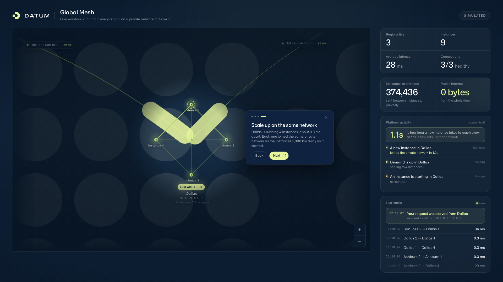
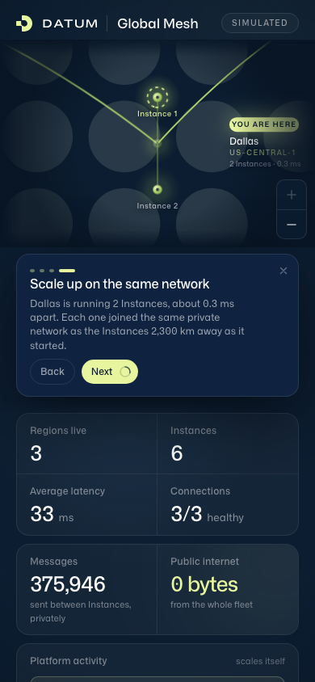

# Global Mesh

**One application, deployed once, running in three cities and talking to itself
over a private network — on one screen, live.**

This repository is `compute-network-demo`. The thing it builds is called
**Global Mesh**, which is the name on the page and in the code. It is a
product-experience demo of [Datum Cloud](https://datum.net): built for someone
seeing Datum for the first time, and for people who want to understand what the
platform does without reading an architecture diagram.


You can run it on your laptop in about two minutes — see
[Run it locally](#run-it-locally) — and it does not need a Datum account to do
that.

## What you are looking at

A dotted world map. Each glowing pin is a **location** where the application is
running, badged with the number of **Instances** there. Arcs between the pins
are real messages travelling between those Instances, labelled with the
round-trip time that was just measured — "Dallas ↔ Ashburn · 30 ms". Down the
right-hand side: the headline numbers, a feed of what the platform is doing,
and a feed of the traffic itself, ticking past a line at a time.

Three things are worth watching for.

**The fleet is one workload.** There is a single application definition. Datum
decides how many copies run in each city and starts them; the badge on each pin
is what it decided. Nobody is orchestrating this by hand.

**None of it touches the public internet.** Every Instance joins a private
network the moment it starts, and finds its peers through the Datum Cloud API.
There are no VPNs, no public addresses between Instances, and no firewall rules.
The "0 bytes" tile is the point of the whole demo.

**A new Instance is useful in about a second.** The platform activity feed
carries the number the demo exists to show: how long a brand-new Instance takes
to become reachable by every one of its peers, in every region. Not how long it
takes to boot — how long until the rest of the fleet can talk to it.

### Things to try

- **Zoom into a city.** Scroll, pinch, use the +/− buttons, or click a pin. The
  location fans out into its individual Instances, joined by the
  sub-millisecond links they use locally. Press "Whole fleet" to go back, or
  just leave it alone and it returns by itself.
- **Find "You are here".** The Instance that served your page is marked.
  Visitors are routed to the nearest one, so two people in different cities see
  the same mesh from different vantage points.
- **Watch the activity feed for a minute.** Each location scales with its own
  demand, and they do not move together. "Demand up in San Jose — scaled to 4
  Instances." A new Instance arrives with an amber ring and turns green the
  moment every peer can reach it. On the way out it drains, its links thinning
  to a dashed trace before it goes.
- **Watch the map when a traffic line appears.** The feed and the arcs are the
  same events, so the matching arc lights up as the line scrolls in.
- **Hover or click a city** for its private address, uptime, how long it took to
  join the network, and how many peers it can reach.


## The guided walkthrough

The demo explains itself, in two phases that want opposite controls.

**The intro** is four hand-written cards. Each names something Datum does for
you and then points at the thing on screen that proves it. It plays on arrival
and floats over the map. Nothing is happening while it runs — the map is a
picture and these are its captions — so it has Back, Next and a progress ring,
and anyone who missed a line can go back for it.

| # | Card |
| --- | --- |
| 1 | **Deploy global workloads securely.** One workload definition, deployed once, is now 10 Instances across Dallas, Ashburn and San Jose — and each one is reachable only by the rest of the fleet. |
| 2 | **Let Datum choose where it runs.** Datum placed 4 in San Jose, 3 in Dallas and 2 in Ashburn. The badge on each pin is what it decided to run there, and it moves as demand does. |
| 3 | **Reach every region privately.** Ashburn reaches San Jose in 57 ms, and the fleet has sent 0 bytes over the public internet. Datum set that private network up when the workload deployed. |
| 4 | **Scale up on the same network.** Dallas is running 3 Instances, about 0.3 ms apart. Each one joined the same private network as the Instances 2,300 km away as it started. |

Every number is read off the running fleet as the card shows it, so the words
and the screen cannot drift apart. The camera goes with the cards: the first
three frame the whole fleet, and the fourth flies right in until a location's
Instances fan out and can be counted one by one.



**Live narration** takes over when the intro finishes, and raises a card each
time the workload actually does something: a location scales up or down, a new
Instance joins the private network, an Instance drains. There is no paging
through that half — a scale-up cannot be rewound. Where an intro card names a
capability, a narration card reports something that just happened, and says
when.

| Event | Card |
| --- | --- |
| `scaled-up` | **Demand is rising in Dallas.** Dallas is scaling itself to 4 Instances. The rest of the fleet carries on exactly as it is. |
| `scaled-down` | **Demand has eased in Dallas.** Dallas is back to 3 Instances. Capacity follows the traffic down as readily as it follows it up. |
| `instance-ready` | **A new Instance joined in 0.9s.** The Instance that just started in Dallas can already reach every peer in Dallas, Ashburn and San Jose. Datum put it on the network as it came up. |
| `instance-stopping` | **An Instance is winding down in Dallas.** Its traffic moves across to the others before it goes, and the rest of the fleet carries on. |


### Controlling the walkthrough

Append `?story=` to the URL.

| `?story=` | What happens |
| --- | --- |
| *(omitted)* | The intro plays once on arrival, then live narration takes over. |
| `on` | The same as omitting it. |
| `loop` | The intro plays on repeat and never hands over. This is the setting for a booth or a kiosk. |
| `off` | No intro; live narration still runs, because a card only appears when the workload has done something worth a sentence. |
| `quiet` | Nothing at all. Use this for screenshots and for a still page. |

Steering the map — a zoom, a pan, a hover — hands the camera to the visitor and
pauses the intro's clock, but keeps the words. The camera comes back, and a
paused intro carries on, once the map has been left alone for twenty seconds, so
a booth screen recovers from a passer-by. Only the card's close button ends the
walkthrough, and "Replay the tour" under the map starts it again. With
`prefers-reduced-motion: reduce`, the camera cuts between framings instead of
gliding and the cards fade rather than travel; the reading time is unchanged.

The intro opens by itself only where the map has somewhere to put a card
without covering what it is pointing at. A phone held sideways has nowhere, so
there the page opens on the map and the numbers and *offers* the tour rather
than starting it. Asking for it explicitly runs it anyway.

### The 60-second talk track

The walkthrough delivers a shorter version of this on its own. This is the one
to say out loud.

> This is one application, deployed once, running in every Datum location. Each
> glowing pin is a location, and the badge on it is how many instances of the
> application are running there.
>
> *(Point at the "You are here" pin.)* This page came from the instance nearest
> to us. Datum routed us there automatically.
>
> These arcs are real traffic. Every couple of seconds each instance says hello
> to every other instance, and that number is the round trip, measured just now.
> Dallas to Ashburn is about 30 milliseconds. Dallas to San Jose is closer to
> 40. The farther apart they are, the slower the pulse.
>
> *(Click Dallas.)* Zoom in and the location opens up: three instances of the
> same application, each on the same private network, reaching each other in a
> third of a millisecond. Zoom back out and they fold into one dot again.
>
> *(Point at the feed.)* This is that traffic as it happens — and the top line
> is us: our request, served from Dallas. Watch the map when a line appears.
>
> *(Point at "0 bytes".)* None of it touches the public internet. There are no
> VPNs, no public IP addresses, and no firewall rules to manage. Every instance
> joined a private network the moment it started, and each one finds its peers
> through the Datum Cloud API.
>
> *(Point at the activity feed.)* Nobody is driving this. Demand moves, and each
> location scales on its own — watch San Jose go to four while Dallas comes back
> down to two. And here's the number that matters: a brand-new Instance is
> reachable by every one of its peers, in every region, about a second after it
> starts. No VPN, no firewall rule, no configuration.
>
> That's the promise: write your app once, run it everywhere, and let it talk to
> itself privately and fast.

## Simulate mode and live mode

The demo has two ways of knowing what the fleet looks like, and they produce the
same page.

**Simulate mode** (`DEMO_MODE=simulate`) models a fleet across the three launch
locations — us-central-1 (Dallas), us-east-1 (Ashburn) and us-west-1 (San Jose)
— with latencies worked out from the real distances between them, and a
workload that scales itself in each. Dallas breathes between two and five
Instances on an 88-second cycle, San Jose runs a shorter 65-second cycle on a
different phase, and Ashburn stays steady enough to read as a reference, so
anyone watching for a minute sees both a scale-up and a scale-down. Every
Instance starts, joins the mesh and later drains on a lifecycle derived from its
name, so the same fleet behaves the same way on every run. The page says
`SIMULATED` in the corner while this is on. **This is the mode the demo runs in
today**, and the mode to use in front of an audience.

**Live mode** (`DEMO_MODE=live`) discovers the real Instances of a real workload
through the Datum Cloud API, and measures real round-trip times between them
over the private network. It needs a Datum project, a service account with read
access to compute resources, and — this is the part that is not yet true
everywhere — the Instances need a route from the private network to the Datum
Cloud API. See [Current limitations](#current-limitations).

Everything above simulate and live is shared: the same aggregation, the same
activity stream, the same page. Nothing in `web/` knows which one is underneath.

## Run it locally

You do not need a Datum account.

```sh
git clone https://github.com/datum-labs/compute-network-demo.git
cd compute-network-demo
(cd web && npm install && npm run build)
DEMO_MODE=simulate go run .
# open http://localhost:8080
```

You need Go 1.26+ and Node 22+. The web build writes into `internal/site/dist`,
where the Go binary embeds it, so the web build has to run before the Go one.

Or with Docker, which does both steps for you:

```sh
docker build -t global-mesh:local .
docker run --rm -p 8080:8080 -e DEMO_MODE=simulate global-mesh:local
```

To work on the page with hot reload, keep the Go server running and start Vite
in a second terminal. It proxies `/api` and `/mesh` back to port 8080.

```sh
cd web && npm run dev    # http://localhost:5173
```

### Settings

| Variable | Default | Purpose |
| --- | --- | --- |
| `DEMO_MODE` | `live` | `simulate` models a fleet; `live` discovers real Instances |
| `DEMO_CHURN` | `on` | Simulate: each location scales with demand; `off` pins every location at its floor |
| `DEMO_FAULTS` | `off` | Simulate: breaks one Dallas–Ashburn pair, to show a degraded link |
| `DATUM_PROJECT` | | Live: project to discover Instances in |
| `DATUM_WORKLOAD` | `global-mesh` | Live: workload name to discover |
| `DATUM_CREDENTIALS_FILE` | `/etc/datum/credentials.json` | Live: service-account key JSON |
| `DATUM_API_URL` | | Live: Datum Cloud API endpoint |
| `DATUM_AUTH_URL` | | Live: auth server, for OIDC discovery |
| `MESH_PEERS` | | Live: fallback peer list, `us-central-1=fd20:…,us-east-1=fd20:…` |
| `MESH_SELF` | | Override this Instance's name, normally detected from its address |
| `MESH_PORT` | `8080` | Port peers listen on |
| `MESH_PING_INTERVAL` | `2s` | How often each peer is messaged |
| `LISTEN_ADDR` | `[::]:8080` | Listen address (dual-stack) |

## Deploy it to Datum

[`deploy/`](deploy/) holds everything needed to stand this up in a fresh Datum
project, and [`deploy/README.md`](deploy/README.md) is the ordered walkthrough.
The short version, for simulate mode, which needs no credentials at all:

```sh
datumctl auth update-kubeconfig --kubeconfig ./project.kubeconfig --project <PROJECT>
export KUBECONFIG=$PWD/project.kubeconfig
kubectl apply -f deploy/00-network.yaml
kubectl apply -f deploy/10-workload.yaml
kubectl apply -f deploy/20-ingress.yaml
kubectl get httpproxy global-mesh -o jsonpath='{.status.hostnames[0]}'
```

Every value you have to supply is marked `FILL IN` in the manifests. The main
ones are the city codes of the locations your project can use, and — for live
mode — your project and organization names, the two UIDs the platform assigns,
and your environment's API endpoints.

## How it works

Every Instance runs the same single static binary, and that binary contains the
page.

1. **Discovery.** Every 5 seconds the Instance lists its workload's Instances
   through the Datum Cloud API, authenticating the way `datumctl login
   --credentials` does: it signs a short-lived assertion with the service-account
   key and trades it for an access token. It works out which Instance it is by
   matching its own network addresses. City names and coordinates come from the
   Locations API, with a built-in table as a fallback. If the API cannot be
   reached, it falls back to the `MESH_PEERS` list and the page shows a subtle
   "Static peers" marker, so it never quietly misrepresents where its view came
   from.
2. **Traffic.** Every 2 seconds each Instance sends a tiny request to
   `/mesh/ping` on every peer's private address, and records the median round
   trip, the success rate and the bytes on the wire. Requests stay a few hundred
   bytes, well under the network's MTU. Each Instance keeps its last fifty
   exchanges, which is what the live feed is built from.
3. **Aggregation.** When a browser asks any Instance for `/api/mesh`, that
   Instance collects every peer's own measurements from `/mesh/local` over the
   private network, in parallel, with short timeouts. So the page shows the whole
   mesh whichever Instance served it. The result is cached for a second. An
   unreachable peer never breaks the view — its arcs just turn red.

```
browser ──HTTPProxy──▶ nearest Instance ──/mesh/local──▶ every peer (private network)
                              │
                              └── Datum Cloud API: list Instances, Locations
```

The Go module has **no dependencies outside the standard library**, and builds
with `CGO_ENABLED=0` into one static binary. The page is React 19, TypeScript,
Tailwind v4 and `@datum-cloud/datum-ui`, built by Vite. The dotted world map and
its projection come from the Datum Cloud portal's edge overview.

**The map is built to hold 60fps**, because it runs on a projector, on a laptop
with its fans up, and on a phone. Blur is the trap: a Gaussian filter or a
backdrop blur over anything animated is re-rasterised every frame, and at full
screen the glow around the traffic streaks alone was costing half the frames.
The glows are gradients and heavier strokes instead, the near-opaque cards
dropped their backdrop blur, and labels are placed with transforms rather than
`left`/`top` so the camera never triggers layout.

It is built for phones as well as projectors. Which layout appears is decided by
the shape of the space the map would get rather than the window's pixel count: a
tall, narrow window stacks the map edge-to-edge as the hero with the numbers
under it, and a wide one puts the panel beside it. The map always fills the box
it is given and the camera crops to suit, so there are never bands of empty
ocean.



## Publishing the image

`.github/workflows/publish.yaml` builds and pushes to
**`ghcr.io/datum-labs/compute-network-demo`** using the workflow's built-in
token. It runs on pushes to `main`, on `v*` tags, and on demand.

| Tag | When | Moves? |
| --- | --- | --- |
| `sha-<12 chars>` | every publish | no |
| `main` | pushes to the default branch | yes |
| `v1.2.3` | a `v*` tag or a published release | no |
| `latest` | a `v*` tag or a published release | yes |

Deploy manifests default to `:main` so a fresh clone works. Pin a `sha-` or
`v*` tag for anything you intend to leave running.

Two things about this build are deliberate and worth not "fixing":

- **No provenance, no SBOM, no OCI media types.** Attestations
  turn the pushed artifact into an OCI image index, and the Datum runtime that
  pulls this image selects a plain `application/vnd.docker.distribution.manifest.v2+json`.
  This is why the workflow does not use the shared organization publish
  workflow, which attaches provenance. In `docker buildx` terms that is
  `--provenance=false --sbom=false` plus
  `--output type=image,push=true,oci-mediatypes=false` — media types are an
  exporter option rather than a build flag.
- **linux/amd64 only.** A multi-platform push is a manifest list by definition,
  which runs into the same thing, and there is no arm64 instance type to run it
  on. The Dockerfile is architecture-neutral, so building another platform by
  hand works if that changes.

### If the package ever comes out private

The package published here is public and pulls anonymously, which is why the
deploy manifests carry no image pull secret. Do not assume that of the next
one: a GHCR package created by a workflow usually inherits its visibility from
the repository, but a previous push under this organization landed as a
**private** package even though the repository was public, and the REST API for
changing package visibility returned 404 for it. If
`docker pull ghcr.io/datum-labs/compute-network-demo:main` ever fails
anonymously, fix it once by hand:

> GitHub → the `datum-labs` organization → **Packages** →
> `compute-network-demo` → **Package settings** → **Change visibility** →
> Public.

While you are there, "Manage Actions access" should list this repository with
Write, which the workflow needs and which is set up automatically on the first
push.

Until that is done, a deployment needs an image pull secret. The
`imagePullSecrets` stanza in `deploy/10-workload.yaml` is commented out for
exactly this case.

### The unikernel image is built by hand

The demo also runs unmodified on the `unikernel` runtime class, which boots the
binary as a unikernel instead of inside a VM with a kernel and a userland. Both
tiers serve the same page, so they can be shown side by side.

That image is **not** built by CI, because it is not an ordinary container
image. The unikernel tier needs an OCI image whose platform is
`kraftcloud/x86_64` and whose single layer carries an EROFS root filesystem.
Producing one needs the `datumctl` compute plugin locally:

```sh
datumctl compute build --analyze --push \
  --output <REGISTRY>/<NAMESPACE>/compute-network-demo-unikernel:<TAG> .
```

`build` uses `Dockerfile.datum` when it is present, which is why the unikernel
image is defined there rather than in `Dockerfile`. That file differs from the
general-purpose one in two ways the packager cares about: it ends at `scratch`,
because the root filesystem is held in guest RAM and every unused file costs
memory at boot; and it leaves `WORKDIR` at `/`, because the packager emulates a
non-root `WORKDIR` by wrapping the entrypoint in a shell, and a scratch image
has no shell to wrap it with. (The distroless `:nonroot` bases set
`WORKDIR /home/nonroot`, which is why they cannot be packaged as-is.)

The binary itself needs no special linking — it is the same `CGO_ENABLED=0`
static build the container image uses. `--analyze` confirms the entrypoint
before packaging.

Then point `deploy/unikernel/10-workload.yaml` at the result. Teaching CI to do
this would mean running the compute plugin and its packager on a hosted runner,
which is not something the toolchain supports today.

## Current limitations

Worth being straight about.

- **It runs in simulate mode.** Live mode is implemented and tested, but it is
  not what is deployed, because the private network is IPv6-only and the Datum
  Cloud API is reached over IPv4 with DNS, so an Instance on the private network
  cannot currently call the API to discover its peers. The `MESH_PEERS` fallback
  exists for exactly this and works, but it has to be filled in by hand after the
  Instances have addresses, and it does not follow a fleet that scales.
- **Real cross-region traffic is not proven end to end.** The arcs and the
  timings are real in live mode, but deployments so far have run in one city, so
  the cross-region numbers you see are simulate mode's model of the real
  distances rather than measurements.
- **Latency is measured as HTTP round trips, not as a network path.** A few
  hundred bytes of request and response over the private network, median of the
  recent samples. Good enough to show the shape of the world; not a replacement
  for a proper network measurement.
- **The demo never drives the fleet.** One process serves every viewer, so a cue
  from one visitor's browser would move the world for everyone else watching. A
  card waits for the workload; it never asks it for anything. There is
  deliberately no "make it scale now" button.

## Development

```sh
go vet ./... && go test ./...
cd web && npm run build      # type-checks, then writes internal/site/dist
docker build -t global-mesh:local .
```

Screenshots of each layout live in `docs/`: `screenshot.png` (projector),
`screenshot-zoom.png` (a location expanded into its Instances),
`screenshot-scaling.png`, `screenshot-stacked.png` (a tall window),
`screenshot-tablet.png`, `screenshot-mobile.png` and
`screenshot-mobile-landscape.png`. The walkthrough has one still per intro card
in `docs/story-1.png` … `docs/story-4.png`, plus `docs/story-live.png` and two
phone stills. Take layout shots with `?story=quiet`, so neither the intro nor a
narration card lands under them.

`web/src/narration.ts` reads nothing but the activity event stream that the
server builds by diffing successive observations of the fleet — the same code
path for a simulated fleet and a real one. A live workload needs nothing added
there. The intro in `web/src/intro.ts` is hand-written explanation and always
will be, which is why the two live in separate modules.

## Contributing

Issues and pull requests are welcome. This is a demo rather than a product, so
the bar is "does it still explain Datum clearly in sixty seconds" as much as it
is correctness.

## Licence

[GNU Affero General Public License v3.0](LICENSE), matching the other
`datum-labs` repositories.
