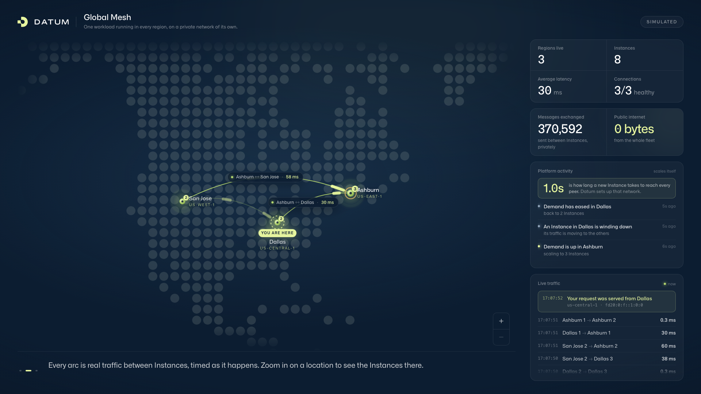

# Global Mesh

One application, deployed once, running in three cities and talking to itself
over a private network. This is a product-experience demo of
[Datum Cloud](https://datum.net), built for people seeing it for the first
time.



Each glowing pin is a city where the application runs, badged with how many
Instances are there. The arcs are real messages travelling between those
Instances, labelled with the round trip that was just measured. Zoom into a
city and it opens up into its individual Instances. The fleet scales itself
while you watch, and the page narrates what it is doing — and none of that
traffic touches the public internet, which is the "0 bytes" tile and the point
of the whole thing.

The repository is called `compute-network-demo`. The demo is called Global
Mesh, which is the name on the page.

## Run it

```sh
docker run --rm -p 8080:8080 -e DEMO_MODE=simulate \
  ghcr.io/datum-labs/compute-network-demo:main
# open http://localhost:8080
```

That is the whole thing. You do not need a Datum account, and the image is
public, so there is nothing to log in to. Give it a minute and you will see a
location scale up and back down again.

To build it yourself, or to change anything, see
[docs/running.md](docs/running.md).

## Deploy it to a Datum project

[`deploy/`](deploy/) has everything needed to stand this up in a project of
your own — the private network, the workload, the public entry point, and the
identity that live mode needs. [`deploy/README.md`](deploy/README.md) walks
through it in order. Simulate mode is three files and needs no credentials at
all.

## It runs a simulated fleet today

The fleet you see is modelled rather than measured. The mode that discovers
real Instances through the Datum Cloud API and times the real round trips
between them is written and tested, but it is not what is deployed: the private
network is IPv6-only and the API is reached over IPv4, so an Instance on the
network cannot yet call the API to find its peers. There is a fallback that
takes a list of peer addresses by hand, and it works, but it does not follow a
fleet that scales.

So the shape of the world is real — the distances, the latencies that follow
from them, the way a new Instance becomes reachable about a second after it
starts — and the specific numbers on screen are the model's. The page says
`SIMULATED` in the corner whenever that is the case.

## More

- [docs/talk-track.md](docs/talk-track.md) — what to say while showing it
- [docs/running.md](docs/running.md) — building from source, settings, the
  walkthrough's URL parameters, and how it works
- [docs/publishing.md](docs/publishing.md) — the published images

## Licence

[GNU Affero General Public License v3.0](LICENSE).
