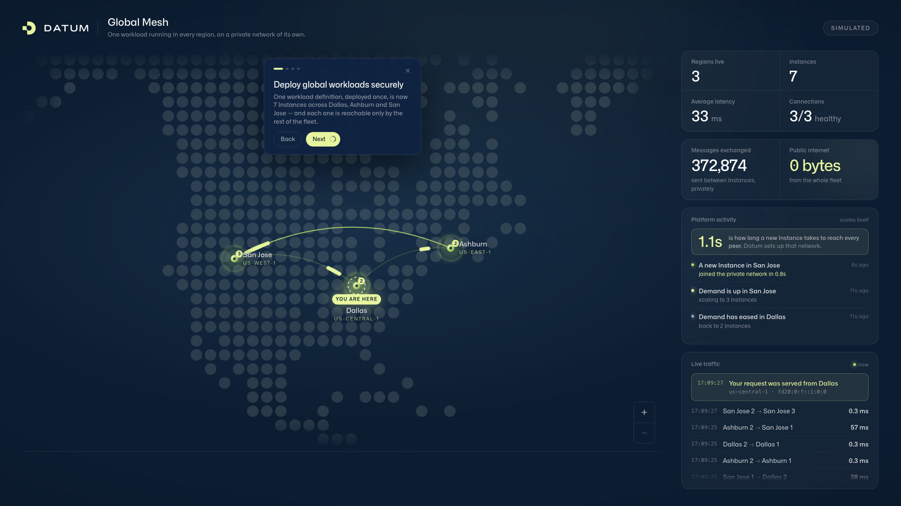
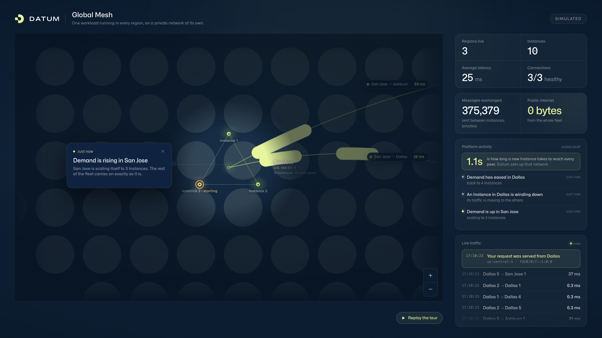
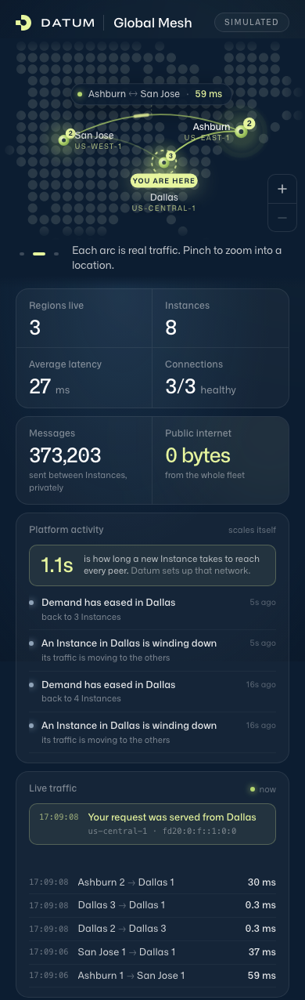

# Running and configuring the demo

## Building from source

The web build writes into `internal/site/dist`, where the Go binary embeds it,
so it has to run first. You need Go 1.26+ and Node 22+.

```sh
(cd web && npm install && npm run build)
DEMO_MODE=simulate go run .
```

To work on the page with hot reload, keep the Go server running and start Vite
in a second terminal. It proxies `/api` and `/mesh` back to port 8080.

```sh
cd web && npm run dev    # http://localhost:5173
```

```sh
go vet ./... && go test ./...
```

## Simulate mode and live mode

The demo has two ways of knowing what the fleet looks like, and they produce
the same page. Nothing in `web/` knows which one is underneath.

**Simulate mode** (`DEMO_MODE=simulate`) models a fleet across the three launch
locations — us-central-1 (Dallas), us-east-1 (Ashburn) and us-west-1 (San Jose)
— with latencies worked out from the real distances between them, and a
workload that scales itself in each. Dallas breathes between two and five
Instances on an 88-second cycle, San Jose runs a shorter cycle on a different
phase, and Ashburn stays steady enough to read as a reference, so anyone
watching for a minute sees both a scale-up and a scale-down. Every Instance
starts, joins the mesh and later drains on a lifecycle derived from its name,
so the same fleet behaves the same way on every run. The page says `SIMULATED`
in the corner while this is on.

**Live mode** (`DEMO_MODE=live`) discovers the real Instances of a real
workload through the Datum Cloud API and measures real round-trip times between
them over the private network. It needs a project, a service account with read
access to compute resources, and a route from the private network to the API.
See [`deploy/README.md`](../deploy/README.md).

## Settings

| Variable | Default | Purpose |
| --- | --- | --- |
| `DEMO_MODE` | `live` | `simulate` models a fleet; `live` discovers real Instances |
| `DEMO_CHURN` | `on` | Simulate: each location scales with demand; `off` pins every location at its floor |
| `DEMO_FAULTS` | `off` | Simulate: breaks one Dallas–Ashburn pair, to show a degraded link |
| `DATUM_PROJECT` | | Live: project to discover Instances in |
| `DATUM_WORKLOAD` | `global-mesh` | Live: workload name to discover |
| `DATUM_CREDENTIALS_FILE` | `/etc/datum/credentials.json` | Live: service-account key JSON |
| `DATUM_API_URL` | | Live: Datum Cloud API endpoint, required |
| `DATUM_AUTH_URL` | | Live: auth server, for OIDC discovery, required |
| `MESH_PEERS` | | Live: fallback peer list, `us-central-1=fd20:…,us-east-1=fd20:…` |
| `MESH_SELF` | | Override this Instance's name, normally detected from its address |
| `MESH_PORT` | `8080` | Port peers listen on |
| `MESH_PING_INTERVAL` | `2s` | How often each peer is messaged |
| `LISTEN_ADDR` | `[::]:8080` | Listen address, dual-stack |

## The guided walkthrough

The page explains itself in two phases. The **intro** is four hand-written
cards, each naming something Datum does and then pointing at the thing on
screen that proves it; it has Back and Next, because nothing is moving while it
runs. **Live narration** takes over afterwards and raises a card each time the
workload does something — a location scales, an Instance joins the network, an
Instance drains. Those cards have no navigation, because a scale-up cannot be
rewound.



Append `?story=` to the URL to change that.

| `?story=` | What happens |
| --- | --- |
| *(omitted)* | The intro plays once on arrival, then live narration takes over. |
| `on` | The same as omitting it. |
| `loop` | The intro plays on repeat and never hands over. Use this for a booth or a kiosk. |
| `off` | No intro; live narration still runs. |
| `quiet` | Nothing at all. Use this for screenshots. |

Steering the map — a zoom, a pan, a hover — hands the camera to the visitor and
pauses the intro's clock, but keeps the words. The camera comes back, and a
paused intro carries on, once the map has been left alone for twenty seconds,
so a booth screen recovers from a passer-by. Only the card's close button ends
the walkthrough, and "Replay the tour" under the map starts it again. With
`prefers-reduced-motion: reduce`, the camera cuts between framings instead of
gliding and the cards fade rather than travel.

Take screenshots with `?story=quiet`, so neither the intro nor a narration card
lands under them.



The page is built for phones as well as projectors. Which layout appears is
decided by the shape of the space the map would get rather than the window's
pixel count, and the map always fills the box it is given, so there are never
bands of empty ocean.



## How it works

Every Instance runs the same static binary, and that binary contains the page.

1. **Discovery.** Every 5 seconds the Instance lists its workload's Instances
   through the Datum Cloud API, authenticating the way `datumctl login
   --credentials` does. It works out which Instance it is by matching its own
   network addresses. City names and coordinates come from the Locations API,
   with a built-in table as a fallback. If the API cannot be reached it falls
   back to the `MESH_PEERS` list, and the page shows a "Static peers" marker so
   it never quietly misrepresents where its view came from.
2. **Traffic.** Every 2 seconds each Instance sends a small request to
   `/mesh/ping` on every peer's private address, and records the median round
   trip, the success rate and the bytes on the wire. Each Instance keeps its
   last fifty exchanges, which is what the live feed is built from.
3. **Aggregation.** When a browser asks any Instance for `/api/mesh`, that
   Instance collects every peer's measurements from `/mesh/local` over the
   private network, in parallel, with short timeouts. So the page shows the
   whole mesh whichever Instance served it. An unreachable peer never breaks
   the view — its arcs turn red.

```
browser ──HTTPProxy──▶ nearest Instance ──/mesh/local──▶ every peer (private network)
                              │
                              └── Datum Cloud API: list Instances, Locations
```

The Go module has no dependencies outside the standard library and builds with
`CGO_ENABLED=0` into one static binary. The page is React 19, TypeScript,
Tailwind v4 and `@datum-cloud/datum-ui`, built by Vite. The dotted world map
and its projection come from the Datum Cloud portal's edge overview.

`web/src/narration.ts` reads nothing but the activity event stream that the
server builds by diffing successive observations of the fleet — the same code
path for a simulated fleet and a real one, so a live workload needs nothing
added there. The intro in `web/src/intro.ts` is hand-written explanation and
always will be, which is why the two live in separate modules.
