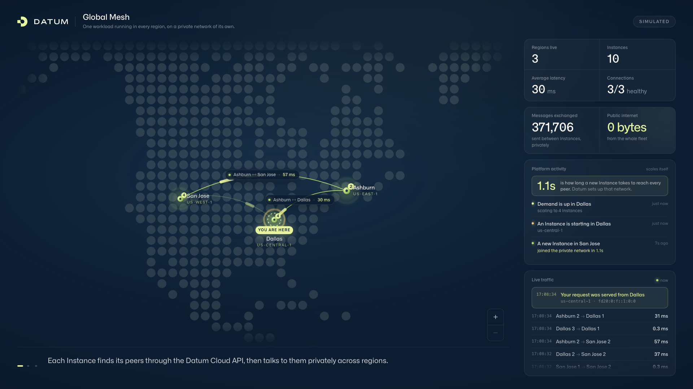
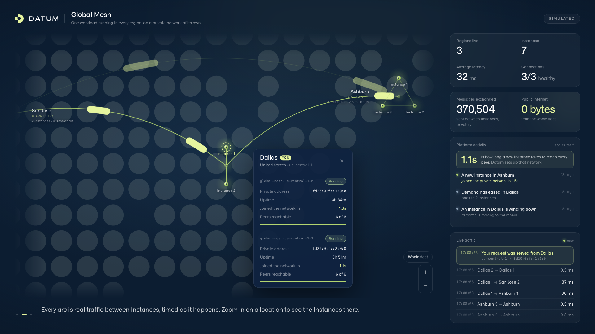

# The 60-second talk track

The walkthrough on the page delivers a shorter version of this on its own. This
is the one to say out loud.

> This is one application, deployed once, running in every Datum location. Each
> glowing pin is a location, and the badge on it is how many instances of the
> application are running there.
>
> *(Point at the "You are here" pin.)* This page came from the instance nearest
> to us. Datum routed us there automatically.
>
> These arcs are real traffic. Every couple of seconds each instance says hello
> to every other instance, and that number is the round trip, measured just
> now. Dallas to Ashburn is about 30 milliseconds. Dallas to San Jose is closer
> to 40. The farther apart they are, the slower the pulse.
>
> *(Click Dallas.)* Zoom in and the location opens up: three instances of the
> same application, each on the same private network, reaching each other in a
> third of a millisecond. Zoom back out and they fold into one dot again.
>
> *(Point at the feed.)* This is that traffic as it happens — and the top line
> is us: our request, served from Dallas. Watch the map when a line appears.
>
> *(Point at "0 bytes".)* None of it touches the public internet. There are no
> VPNs, no public IP addresses, and no firewall rules to manage. Every instance
> joined a private network the moment it started, and each one finds its peers
> through the Datum Cloud API.
>
> *(Point at the activity feed.)* Nobody is driving this. Demand moves, and each
> location scales on its own — watch San Jose go to four while Dallas comes back
> down to two. And here's the number that matters: a brand-new Instance is
> reachable by every one of its peers, in every region, about a second after it
> starts. No VPN, no firewall rule, no configuration.
>
> That's the promise: write your app once, run it everywhere, and let it talk to
> itself privately and fast.

Set the page to `?story=loop` if it is going to sit unattended on a screen, and
`?story=off` if you would rather narrate it yourself without cards appearing
over the map.

